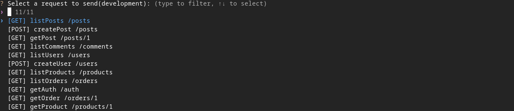

<div align="center">
  <h1>Hyrapi</h1>
  <div align="center">
    
    
  </div>
</div>

Hyrapi is a CLI-based REST API client powered by a YAML collection file. It's designed to simplify making HTTP requests by organizing endpoints, headers, tokens, and parameters in a single configuration file.




## Installation

You can install `hyr` in two ways:

### Method 1: Manual Installation

```bash
git clone https://github.com/hwisnu222/hyrapi.git
cd hyrapi
make build
cd dist/
chmod +x hyr
sudo mv hyr /usr/local/bin/
```

### Method 2: One-Line Install Script

```bash
curl -fsSL https://raw.githubusercontent.com/hwisnu222/hyrapi/main/install.sh | sh
```

## Usage

To use `hyrapi`, you need to provide a YAML collection file:

```bash
hyr -c collections.yml
```

## Sample `collections.yml`

```yaml
servers:
  - url: http://localhost:3000/api/v1
    name: development
    description: development server
  - url: http://example.com/api/v1
    name: staging
    description: staging server
  - url: http://example.com/api/v1
    name: production
    description: production server

variables:
  global_variable: value
  development:
    token: value
  staging:
    token: value
  production:
    token: value

paths:
  - endpoint: /incomes
    name: getIncomes
    method: GET
    auth:
      type: bearer
      token: "{{token}}"
    headers:
      Content-Type: application/json

  - endpoint: /incomes/4
    name: deleteIncomes
    method: DELETE
    auth:
      type: bearer
      token: "{{token}}"
    headers:
      Content-Type: application/json
```

## Structure Explained

### `servers`

Defines base URLs for your API. You can use multiple environments (dev, staging, prod).

### `variables`

Declare reusable variables like tokens, API keys, etc.

### `paths`

List of API requests:

- `endpoint`: the path to the API route
- `name`: a label to identify this request
- `method`: HTTP method (`GET`, `POST`, `PUT`, `DELETE`, etc.)
- `auth`: authentication configuration
  - `type`: `bearer` (currently supported)
  - `token`: value or reference using `{{variable}}`
- `headers`: optional headers to send with the request

### Authentication (`auth`)

The `auth` section allows you to configure how each request is authenticated. Below are the supported types and their configuration:

#### Bearer Token

```yaml
auth:
  type: bearer
  token: "{{token}}"
```

Sends an `Authorization: Bearer <token>` header.

#### Basic Auth

```yaml
auth:
  type: basic
  username: admin
  password: secret
```

Sends an `Authorization: Basic <base64-encoded-credentials>` header.

#### API Key (Header-based)

```yaml
auth:
  type: apikey
  api_key: abc123
  api_key_header: X-API-Key
```

Sends `X-API-Key: abc123` in the request header. The header name can be customized using `api_key_header`.

#### Digest Auth

```yaml
auth:
  type: digest
  username: admin
  password: secret
```

Supports HTTP Digest Authentication.

## Features

- YAML-based API collection
- Built-in support for Bearer Token authentication
- Easily switch between environments
- CLI interface for fast request execution

## Roadmap Ideas (Planned Features)

- Support for:
  - `basic` and `custom` auth types
  - Request body for `POST`, `PUT`, `PATCH`
  - Path parameters and query strings
  - Response highlighting
  - Response time and size display
- Collection management (similar to Postman)
- Output formatting (JSON / Table / Raw)

## Author

Hyrapi by [@hwisnu222](https://github.com/hwisnu222)

Contributions and feedback are welcome!
